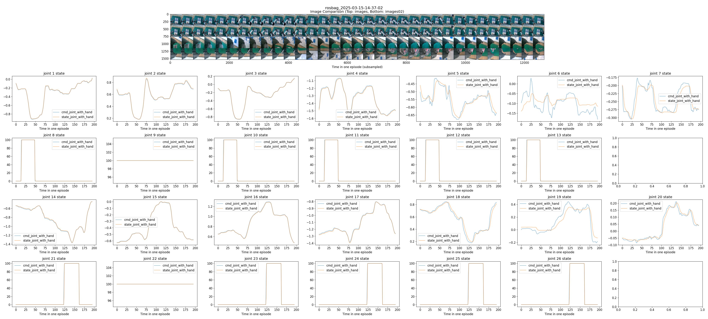
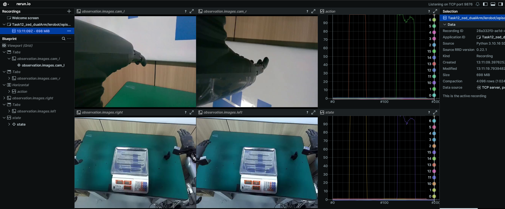

# Kuavo IL - 机器人模仿学习操作文档

Kuavo IL 是一个完整的机器人模仿学习（Imitation Learning） 文档，支持数据采集、转换、模型训练和部署的全流程。本框架集成了多种先进的模仿学习方法，包括 Diffusion Policy 和 LeRobot，可用于各种机器人操作任务。

## 项目结构

```text
kuavo_il/
├── kuavo/                # 核心功能模块
│   ├── kuavo_1convert/   # 数据采集与转换
│   ├── kuavo_2train/     # 模型训练
│   ├── kuavo_3deploy/    # 模型部署
│   └── kuavo_utils/      # 通用工具函数
├── diffusion_policy/     # Diffusion Policy 框架
└── lerobot/              # LeRobot 框架
```

## 1. 数据采集转换 (kuavo_1convert)

### 1.1 数据采集

#### 1.1.0 数据采集注意(实机数采成本很高，需注重质量)

- 检查topic是否齐全，帧率，时间戳是否正确
- 检查关节数据是否有0

- 如果需要重复抓取，需要在完成任务后恢复至初始位置(从rviz或其他可视化方式，保证图像中的起始位置类似)
- 开始记录之后数采员才能移动手臂，避免前一部分没录上
- 尽可能保证开始时候有两个及以上摄像头观察到被抓物体
- 双手大拇指触摸手柄下方两个键保证拇指内收
- 腕部摄像头别装反(保证多尽可能看向被操作物体而不是手背)

#### 1.1.1 使用 app.py UI 界面采集(方法一,适合用户)

[UI界面采集](https://www.lejuhub.com/highlydynamic/kuavobrain/-/blob/master/src/kuavo_data_pilot/docs/1.gradio%E7%BD%91%E9%A1%B5app%E4%BD%BF%E7%94%A8/%E5%BF%AB%E9%80%9F%E5%BC%80%E5%A7%8B.pdf)

#### 1.1.2 使用 record.py 脚本采集(方法二)

1. 组织目录结构

```bash
KUAVO_IL_WORKSPACE=～/hx/kuavo_il
cd $KUAVO_IL_WORKSPACE

DATASET_DIR=~/kuavo 
TASK_NAME=TASK0_weighting 
mkdir -p $DATASET_DIR/$TASK_NAME/rosbag
cp kuavo/kuavo_1convert/collect_data/record.py $DATASET_DIR/$TASK_NAME/rosbag 

/home/$USER/
├── kuavo
│   └── Task2-RearangeToy 
│       └── rosbag
│           └── record.py
```

2. 在 rosbag 目录里开启终端运行 [`python record.py`](kuavo/kuavo_1convert/collect_data/record.py) 记录
```bash
cd $DATASET_DIR/$TASK_NAME/rosbag
python record.py -b ./ -c 50 -d 20 -w 5  #-b本地rosbag目录， -c采集episodes数量， -d任务持续时间， episode间休息还原场景时间
```
- 若有任务变化，调整 record.py 中的`TOPIC_LIST` 适应任务
```py
    TOPIC_LIST = [
        "/cam_l/color/image_raw/compressed",    # 左手腕部相机
        "/cam_r/color/image_raw/compressed",    # 右手腕部相机
        "/joint_cmd",                           # 机器人控制话题, dualArm_joint = left_arm + right_arm = msg.joint_q[12:29] + msg.joint_q[19:26], 
        "/sensors_data_raw",                    # 机器人状态话题, dualArm_joint = left_arm + right_arm = msg.joint_data.joint_q[12:29] + msg.joint_data.joint_q[19:26], 
        "/control_robot_hand_position",         # 灵巧手控制话题, len(msg.left_hand_position) + len(msg.right_hand_position) = 6 + 6 = 12. 0开100合，除拇指两个关节值，其他手指一个关节值，
        "/control_robot_hand_position_state",   # 灵巧手状态话题(目前无法获取，采集数据暂时只更新时间戳转发灵巧手控制话题) 
        "/zedm/zed_node/left/image_rect_color/compressed",  # 头部zed左眼相机
        "/zedm/zed_node/right/image_rect_color/compressed", # 头部zed右眼相机
        ]
```
- record.py会检测以上`话题`及其`期望频率`，以及是否有`时间戳`(具体修改record.py)
- 及时检查 rosbag 包，确保话题和帧率符合要求(使用可视化软件`Foxglove`或者`PlotJuggler`)
- 录制过程出错及时`ctrl+c`终止并删除最新bag包然后重新运行record.py
- 注意系统时间错误导致传感器时间戳差异过大(TODO：加入record.py检测)


### 1.2 数据转换

Kuavo IL 支持多种数据格式转换，以适应不同的训练框架需求。

#### 1.2.1 ROS Bag 转 Zarr 格式

Zarr 格式是一种高效的多维数组存储格式，适合大规模机器学习数据集。

1. 正确修改config中对应的yaml

2. 如果时间戳出现远古时间，可以修改代码使用bag包接受到消息的时间

```bash
# bag -> zarr
python kuavo/kuavo_1convert/cvt_rosbag2zarr.py -b ~/hx/kuavo/Task12_zed_dualArm/rosbag -c kuavo/kuavo_1convert/config/Task12_zed_dualArm.yaml -n 50 -l 40 -v v0
```

参数说明：

- `-b, --bag_folder_path`: ROS bag 文件目录
- `-c, --config`: 配置文件路径(根据bag话题修改对应的yaml文件，内包含不同话题的处理方法以及抽帧值)
- `-n, --num_of_bag`: 需要处理的bag包数量, 默认`bag_folder_path`目录所有bag包
- `-a, --append`: 如果需要合并多个任务的数据，这里可以加上`-a`
- `-l, --jpeg_compress_level`: 图像的压缩质量，越小质量越低(0-100)

转换完毕后的目录结构:
```bash
/home/$USER/
├── kuavo
  ├── Task12_zed_dualArm
  │   ├── kuavo-zarr
  │   ├── plt-check(检查电机的cmd和state曲线)
  │   ├── raw-video
  │   ├── rosbag
  │   └── sample-video
```

#### 1.2.2 ROS Bag 转 LeRobot 格式

LeRobot 格式是 LeRobot 框架专用的数据格式。
1. 修改kuavo_dataset中的配置文件

```bash
# bag -> lerobot 
python kuavo/kuavo_1convert/cvt_rosbag2lerobot.py --raw_dir $DATASET_DIR/Task12_zed_dualArm/rosbag --repo_id Task12_zed_dualArm/lerobot
```
这会在`raw_dir`上级目录生成`lerobot`格式数据  

参数说明：
- `--raw_dir`: ROS bag 文件目录
- `--repo_id`: 数据集仓库 ID

```bash
/home/$USER/
├── kuavo
  ├── Task12_zed_dualArm
  │   ├── kuavo-zarr
  │   ├── lerobot(新生成的lerobot格式数据集)
  │   ├── plt-check
  │   ├── raw-video
  │   ├── rosbag
  │   └── sample-video
```

#### 1.2.3 数据可视化

转换完成后，可以使用 LeRobot 提供的工具进行数据可视化，检查数据质量：

```bash
# 可视化转换完毕的 lerobot dataset：
python lerobot/lerobot/scripts/visualize_dataset.py --repo-id Task12_zed_dualArm/lerobot --root $DATASET_DIR/kuavo/Task12_zed_dualArm/lerobot --episode 55 --local-files-only 1
```


## 2. 模型训练 (kuavo_2train)

Kuavo IL 支持多种模型训练框架，包括 Diffusion Policy 和 LeRobot。

### 2.1 Diffusion Policy 训练

[Diffusion Policy](https://github.com/real-stanford/diffusion_policy) 是一种基于扩散模型的机器人策略学习方法。

#### 单卡训练

```bash
python diffusion_policy/train.py --config-name=Task12_zed_dualArm 
```

# 命令行指定参数
python diffusion_policy/train.py --config-name=Task12_zed_dualArm task.dataset_path=/home/lejurobot/hx/kuavo/Task12_zed_dualArm/kuavo-zarr/Task12_zed_dualArm.zarr.zip dataloader.batch_size=8 training.num_epochs=2 training.checkpoint_every=1
```

#### 数据并行训练(Accelerate)
```bash
GPUS=2
DATASET='/home/lejurobot/hx/kuavo/Task14_cup'
 accelerate launch --num_processes=2 --main_process_port=29501 \
    /home/lejurobot/hx/kuavo_il/diffusion_policy/train.py \
    --config-name=Task14_cup  task.dataset_path=/home/lejurobot/hx/kuavo/Task14_cup/kuavo-zarr/Task14_cup.zarr.zip
hydra.run.dir='/home/lejurobot/hx/kuavo/Task14_cup/train_oridp/outputs/${now:%Y.%m.%d}/${now:%H.%M.%S}_${name}_${task_name}' 
```

#### 任务并行训练(Ray)

```bash
export CUDA_VISIBLE_DEVICES=2,3
ray start --head --num-gpus=2
python diffusion_policy/ray_train_multirun.py --config-dir=diffusion_policy/config --config-name=Task12_zed_dualArm.yaml
```

### 2.2 LeRobot 训练

[LeRobot](https://github.com/huggingface/lerobot) 是 Hugging Face 开发的机器人学习框架。

#### 单机训练 #kuavo_il目录下
```bash 
CUDA_VISIBLE_DEVICES=0
python lerobot/lerobot/scripts/train.py \
      --dataset.repo_id v0/lerobot \
      --policy.type act \
      --dataset.local_files_only true \
      --dataset.root ~/luyuang/nls/v0/lerobot
```

#### 分布式训练

```bash
CUDA_VISIBLE_DEVICES=2,3
GPUS=2 
accelerate launch --num_processes=1 --main_process_port 29509\
    ~/hx/kuavo_il/lerobot/lerobot/scripts/train_distributed.py \
    --dataset.repo_id Task14_cup/lerobot \
    --policy.type  act \
    --dataset.local_files_only true \
    --dataset.root ~/hx/kuavo/Task14_cup/lerobot\
    --output_dir ~/hx/kuavo/Task14_cup/train_lerobot
```


## 3. 模型部署 (kuavo_3deploy)

训练完成的模型可以部署到实际机器人上进行测试和应用。Kuavo IL 提供了多种部署方式，支持不同的机器人平台。

### 3.1 环境检查

在部署前，建议先检查环境是否满足要求：

```bash
python kuavo/kuavo_3deploy/env.py
```
若没有灵巧手`状态`话题，转发灵巧手`控制`话题：
```bash
python kuavo/kuavo_3deploy/fake_state.py
```
### 3.2 模型评估

#### 评估 [dp|lerobot] 模型
1. 修改eval.py的test_cfg
```py
test_cfg = {
    'model_fr': 'lerobot', # 'oridp' or 'lerobot'
    'task': 'Task12_zed_dualArm', # task_name
    'ckpt': [   # 默认取ckpt[0]
            '/home/leju-ali/hx/kuavo/Task12_zed_dualArm/train_lerobot/outputs/train/2025-03-21/02-25-36_act/checkpoints/120000/pretrained_model',   #双gpu训练act
            '/home/leju-ali/hx/kuavo/Task12_zed_dualArm/train_lerobot/outputs/train/2025-03-17/16-08-09_act/checkpoints/140000/pretrained_model',
            '/home/leju-ali/hx/kuavo/Task12_zed_dualArm/kuavo-zar_480_toolarge/epoch=0060-train_loss=0.012.ckpt',
            '/home/leju-ali/hx/kuavo/Task12_zed_dualArm/kuavo-zar_480_toolarge/epoch=0040-train_loss=0.016.ckpt',
             '/home/leju-ali/hx/ckpt/epoch=0060-train_loss=0.013.ckpt',
             '/home/leju-ali/hx/ckpt/wks/dataset/dataset_wason_20250307/data/outputs/2025.03.07/21.26.03_train_diffusion_unet_image_Task11_Toy/checkpoints/epoch=0140-train_loss=0.004.ckpt',
             '/home/leju-ali/hx/ckpt/wks/dataset/dataset_wason_20250307/data/outputs/2025.03.09/23.31.47_train_diffusion_unet_image_Task11_Toy/checkpoints/epoch=0100-train_loss=0.007.ckpt',
            ],
    'debug': False,
    'is_just_img': False, 
    'bag': '/home/leju-ali/hx/kuavo/Task12_zed_dualArm/rosbag/rosbag_2025-03-15-14-35-05.bag',
    'fps': 10,  # 根据训练模型时数据集的帧率修改(常用10hz)
}
```

2. 修改环境配置文件

```py
W, H = 640, 480 # 根据训练数据调整
DEFAULT_OBS_KEY_MAP = {
    "img":{
        "img01": {
            "topic":"/zedm/zed_node/left/image_rect_color/compressed",
            "msg_type":CompressedImage,
            'frequency': 30,  # 根据具体相机的发布频率(要求发布频率稳定)
            'handle': {
                "params": {
                    'resize_wh': (W, H),  
                }
            }
        },
        "img02": {
            "topic":"/zedm/zed_node/right/image_rect_color/compressed",
            "msg_type":CompressedImage,
            'frequency': 30,
            'handle': {
                "params": {
                    'resize_wh': (W, H),  
                }
            }
        },
        "img03": {
            "topic":"/cam_l/color/compressed",
            "msg_type":CompressedImage,
            'frequency': 30,
            'handle': {
                "params": {
                    'resize_wh': (W, H), 
                }
            }
        },
        "img04": {
            "topic":"/cam_r/color/compressed",
            "msg_type":CompressedImage,
            'frequency': 30,
            'handle': {
                "params": {
                    'resize_wh': (W, H),  
                }
            }
        },
    },
    "low_dim":{
        "state_joint": {
            "topic":"/sensors_data_raw",
            "msg_type":sensorsData,
            "frequency": 500, # 机器人状态话题发布频率
            'handle': {
                "params": {
                    'slice': [(12,19), (19, 26)]  # 0:12, 12:19(左手7joints), 19:26(右手7joints), 26:28.
                }
            },
        },
        "state_gripper": {
            "topic":"/control_robot_hand_position_state",
            "msg_type":robotHandPosition,
            "frequency": 100, # 灵巧手状态话题发布频率
            'handle': {
                "params": {
                    'slice': [(0,1), (6,7)] # 一只灵巧手有6个关节。模型训练只取左，右手的大拇指第一个关节的状态表示所有关节的状态。
                }        
            },
        },
    }
}
```

env输出接口统一：

```python
env.obs_buffer.wait_buffer_ready(just_img = False)
obs_data, camera_obs, camera_obs_timestamps, robot_obs, robot_obs_timestamps = env.get_obs(just_img = False)
obs = {
    'agent_pos': (n_obs_steps, low_dim)
    'img01': (n_obs_steps, h, w, c)
    'img02': (n_obs_steps, h, w, c)
    'img..':(n_obs_steps, h, w, c)
    "timestamp": (n_obs_steps,)
}
```

1. 将机器人控制至初始位置(VR或者外部控制)
TODO

1. 运行模型推理代码  

运行外部控制前：如果之前的控制来自VR，则须`退出VR控制模式(长摁遥控器B)`，然后在推理终端运行`rosservice call /arm_traj_change_mode "control_mode: 2" `，运行后手会小幅度抽搐

```bash
python kuavo/kuavo_3deploy/eval.py
```

### 3.3 端测部署
#### TODO
将训练好的模型部署到Jetson Orin.

```bash
TODO
```

## 4. 常见问题与解决方案

- **问题**: 数据采集时 ROS 话题不正确
  **解决方案**: 检查 record.py 中的话题配置，确保与机器人发布的话题一致

- **问题**: 模型训练时内存不足
  **解决方案**: 减小批量大小或使用分布式训练

- **问题**: 模型部署时机器人动作不准确
  **解决方案**: 检查传感器校准，调整模型参数，或增加训练数据多样性

## 5. 参考资料

- [Diffusion Policy GitHub](https://github.com/real-stanford/diffusion_policy)
- [LeRobot GitHub](https://github.com/huggingface/lerobot)
- [项目详细文档](docs/项目说明.md)
- [kuavo接口文档](https://kuavo.lejurobot.com/beta_manual/basic_usage/kuavo-ros-control/docs/4%E5%BC%80%E5%8F%91%E6%8E%A5%E5%8F%A3/%E6%8E%A5%E5%8F%A3%E4%BD%BF%E7%94%A8%E6%96%87%E6%A1%A3/)
